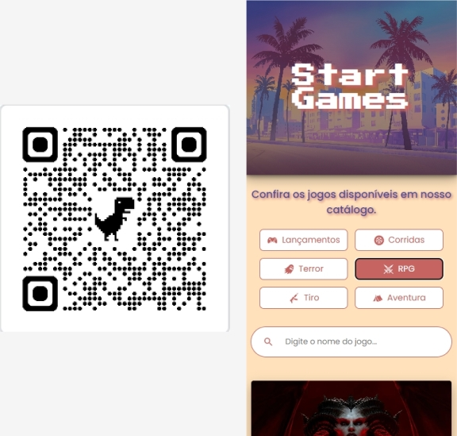
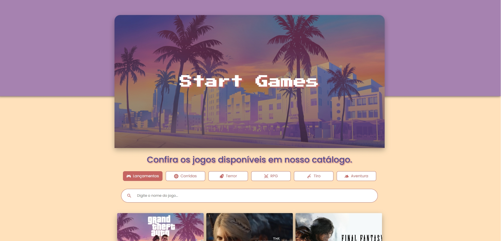

<h1 align="center"> Start Games </h1>

Projeto de um catálogo de jogos que desenvolvi com intuito de praticar o uso de uma coleção de dados, listando diferentes jogos conforme o filtro ou busca aplicada.
 

 

## ⚡ Tecnologias utilizadas

- React / Next.js
- CSS Modules

---

## 📃 Funcionalidades

- ✅ Responsividade para mobile e desktop  
- ✅ Filtro de jogos por categorias  
- ✅ Busca de jogos através da barra de pesquisa
- ✅ Acesso ao catálogo através de um QR code(Simulando um projeto real de cardápio/catálogo digital)

---

## 💻  Demonstração

  
  

 

- [Acesse o projeto online](https://start-games.vercel.app/)

---

## </>